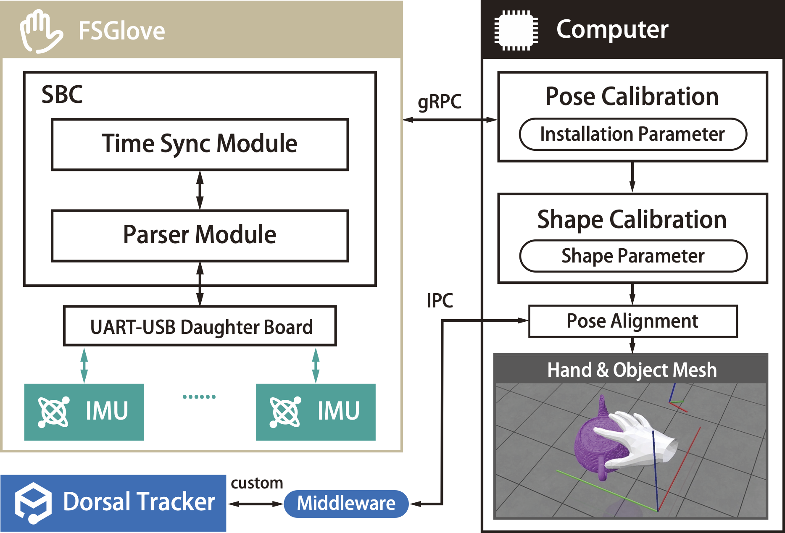
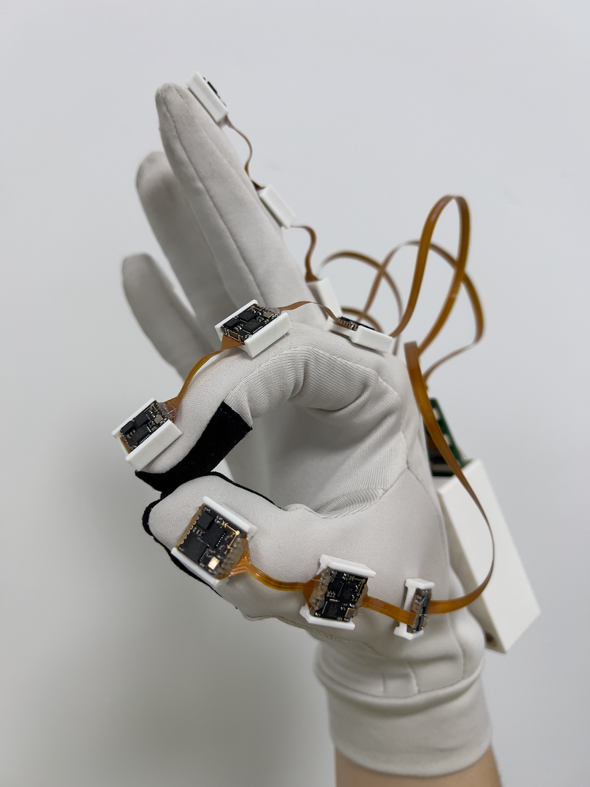

<p align="center">
  <h3 align="center"><strong>FSGlove: <br>An Inertial-Based Hand Tracking System with Shape-Aware Calibration</br></strong></h3>
<p align="center">
    <a href="https://github.com/">Yutong Li</a><sup>1</sup><span class="note">*</span>,
    <a href="https://github.com/">Jieyi Zhang</a><sup>1</sup><span class="note">*</span>,
    <a href="https://github.com/">Wenqiang Xu</a><sup>1</sup>,
    <a href="https://github.com/">Tutian Tang</a><sup>1</sup>,
    <a href="https://github.com/">Cewu Lu</a><sup>1†</sup>,
    <br>
    <br>
    <sup>†</sup>Corresponding authors.
    <br>
    </sup><span class="note">*</span>Equal contribution.
    <br>
    <sup>1</sup>Shanghai Jiao Tong University
    <br>
</p>

<p align="center">
  <table>
    <tr>
      <td></td>
      <td></td>
    </tr>
  </table>
</p>

## Contents

- [Contents](#contents)
- [Introduction](#introduction)
- [Hand Assembly Guide](#hand-assembly-guide)
- [Hand Server Setup](#hand-server-setup)
  - [Overview](#overview)
  - [Build Instructions](#build-instructions)
- [DiffHCal Setup](#diffhcal-setup)
  - [Overview](#overview-1)
  - [Step-by-Step Setup](#step-by-step-setup)
  - [Basic Configuration](#basic-configuration)
- [Ansible Notice](#ansible-notice)
  - [Dorsal Tracker Configuration](#dorsal-tracker-configuration)

## Introduction

Accurate hand motion capture (MoCap) is critical for robotics, virtual reality, and biomechanics, yet existing systems often fail to capture high-degree-of-freedom (DoF) joint kinematics and personalized hand shapes. FSGlove addresses these limitations with an inertial-based system that tracks up to 48 DoFs and reconstructs hand shapes using DiffHCal, a novel calibration method. Equipped with IMUs on each finger joint and dorsum, FSGlove achieves high-resolution motion sensing. DiffHCal integrates with the MANO model via differentiable optimization, resolving joint kinematics, shape parameters, and sensor misalignment in a single step.

> **Note:** The source code for FSGlove will be open-sourced after the reviewing process.

## Hand Assembly Guide  

Please refer to the [official website](https://fsglove.robotflow.ai/) for the detailed hand assembly guide.

## Hand Server Setup

### Overview

The hand server powers the SBC on the FSGlove. It is a standard Golang project that compiles into a single binary and can run on almost any platform. We have tested it on the Raspberry Pi 2W.  

### Build Instructions

Please follow the instructions in the [src/hand_server/README.md](src/hand_server/README.md) to build and run the hand server.

## DiffHCal Setup

### Overview

DiffHCal is developed using `manotorch`, which requires a `PyTorch` environment and the presence of the MANO model. To achieve real-time processing, a capable **NVIDIA GPU** (supporting CUDA 11) is recommended. The source code is organized as a standard Python project at [src/hand_visualiser](src/hand_visualiser), with the main entry point located in `src/hand_visualiser/main_gui_v2.py`.

Given the complex dependencies of this project, we recommend setting up a virtual environment (e.g., a Conda environment) to avoid conflicts. The project also relies on common build tools such as `Make`.

### Step-by-Step Setup

1. Obtain the MANO model from [here](https://mano.is.tue.mpg.de/) and extract it under `assets/mano`. The directory structure should look like this:
   ```text  
   ./assets/mano  
   ├── LICENSE.txt  
   ├── __init__.py  
   ├── models  
   ├── ...  
   ```  

2. Create a virtual environment using `conda`. The DiffHCal project is built with `python@3.10` syntax (e.g., typing annotations) but will likely work on higher versions.
   ```shell  
   conda create -n rfmocap python=3.10  
   conda activate rfmocap  
   ```  

3. Install the dependencies from `requirements.txt`. A single `pip install` command should suffice.  
   ```shell  
   pip install -r requirements.txt  
   ```  
   This will install:  
   - `torch:2.3.0` compiled with `cuda:11.8` runtime.  
   - `numpy:1.22.4` for compatibility reasons.  
   - `manotorch` from the latest GitHub master branch.  
   - `polyscope` for visualization.  
   - `pyrfuniverse`, a binding for [RFUniverse](https://github.com/robotflow-initiative/rfuniverse), used for simulation and tele-operation demo.
   - `grpcio-tools:1.60.0` and `grpcio==1.60.0` for gRPC communication.  
   - Other utilities.  

   > On some Linux systems, you might encounter a `libdl.so` missing issue with `rfuniverse`, preventing it from loading URDF. In this case:
   > 1. Install `libdl.so`:  
   >    ```shell  
   >    sudo apt-get install libc6-dev  
   >    ```  
   > 2. Copy a working `libdl.so` to your working directory.
   > 3. Follow this post to create a soft-link:  
   >    ```shell  
   >    sudo ln -s /lib/x86_64-linux-gnu/libdl.so.2 /lib/x86_64-linux-gnu/libdl.so  
   >    sudo apt install minizip  
   >    ```  

**Optional:** Update the gRPC client. Run the `make task.pb.python` command to update the gRPC client code in `src/api` from the latest `assets/pb/*.proto` files.
   ```shell  
   $ make task.pb.python  
   ```  
   ```
   ===========> Generating protobuf files for python  
   /opt/conda/envs/test/lib/python3.10/site-packages/grpc_tools/protoc.py:21: DeprecationWarning: pkg_resources is deprecated as an API. See https://setuptools.pypa.io/en/latest/pkg_resources.html  
     import pkg_resources  
   ```  

4. Finally, you can run the DiffHCal GUI:  
   ```shell  
   python -m src  
   ```  

### Basic Configuration

The DiffHCal GUI automatically detects its default configuration at `$WORKING_DIRECTORY/config.json`. If the file is absent, it will be created and populated with default values.  

## Ansible Notice

The project has a series of ansible playbooks, they require `synchronize` module, which can be installed via:

```shell
ansible-galaxy collection install ansible.posix
```

Then you can deploy these playbooks:

```shell
ansible-playbook -i inventory.ini manifests/playbook/....yml --ask-become-pass
```

### Dorsal Tracker Configuration

TBD.
